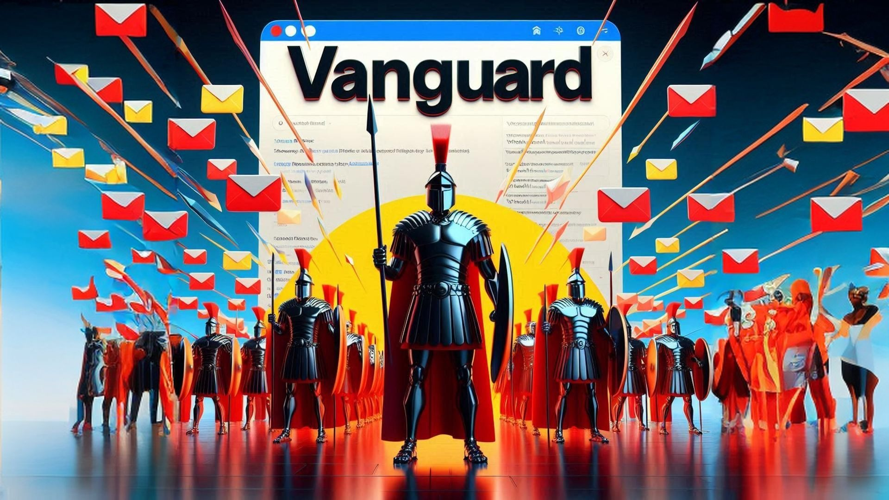

## Project Summary: Vanguard - AI-Powered Email Security Add-in For Data Sensitive Enterprises

1. Project Overview:
   You've developed "Vanguard," an innovative Outlook add-in that leverages AI to enhance email security. This tool is designed to analyze emails in real-time for potential security threats, providing users with immediate feedback on the safety of their incoming messages.

2. Key Features:
   - Real-time email analysis for security threats
   - Integration with an OpenAI-compatible API's in this case Llama 3 70b trained on a very small dataset of sythetic about  for advanced threat detection
   - High level secure interface within Outlook
   - Dynamic light/dark mode support for better accessibility
   - Detailed explanations of security assessments

3. Technologies Used:
   - JavaScript for core functionality
   - HTML and CSS for the user interface
   - Office.js API for Outlook integration for enterprise use cases
   - Axios for making API calls
   - Webpack for bundling and build processes
   - Node.js for the development environment

4. Development Achievements:
   - Successfully set up an Office Add-in development environment 100% local API with zero internet access
   - Implemented a taskpane interface in Outlook
   - Integrated with an AI service (OpenAI-compatible endpoint) for email analysis at a complex level
   - Developed a responsive UI that adapts to Outlook's theme settings
   - Implemented error handling and input sanitization for security
   - Created a build process using Webpack for production-ready code

5. User Experience:
   - Simple one-click analysis of emails
   - Clear visual indicators for email safety status
   - Detailed explanations of AI-generated security assessments
   - Seamless integration with Outlook's existing interface

6. Security Considerations:
   - Implemented input sanitization to prevent XSS attacks
   - Secured API communication with proper authentication and 100% local inference of Llama 3 70B
   - Ensured sensitive information (like API keys) is not exposed in the codebase

7. Development Process:
   - Set up the initial project structure and development environment
   - Developed core functionality for email analysis
   - Created and styled the user interface
   - Integrated with the AI service for threat detection
   - Implemented theme switching and responsiveness
   - Conducted testing and debugging
   - Prepared the project for version control with a comprehensive .gitignore file

8. Potential Impact:
   - Enhances email security for Outlook users and large enterpise users like banks or hospitals
   - Provides an accessible tool for identifying potential phishing or malicious emails
   - Educates users about email security through detailed explanations

9. Future Possibilities:
   - Further refinement of the AI model for more accurate threat detection as there was limited time and not enough syntehtic data generated
   - Additional features like bulk email analysis or integration with other security tools
   - Massive potential for deployment in enterprise environments for enhanced organizational security

This project demonstrates a practical application of AI in everyday productivity tools, addressing the critical need for improved email security. By creating a user-friendly interface and integrating advanced AI capabilities, Vanguard stands as an innovative solution developed within the constraints of a hackathon, showcasing both technical skill and a keen understanding of user needs in the realm of digital security.
